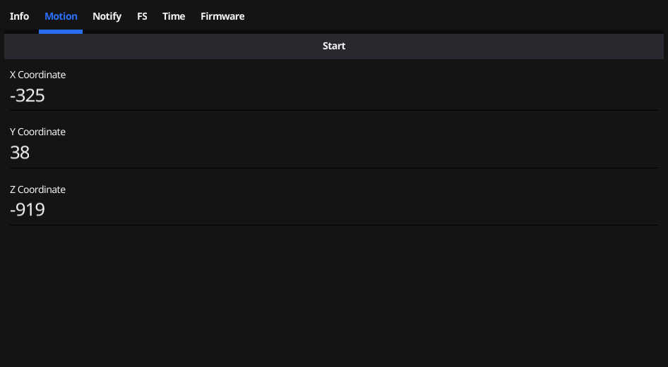
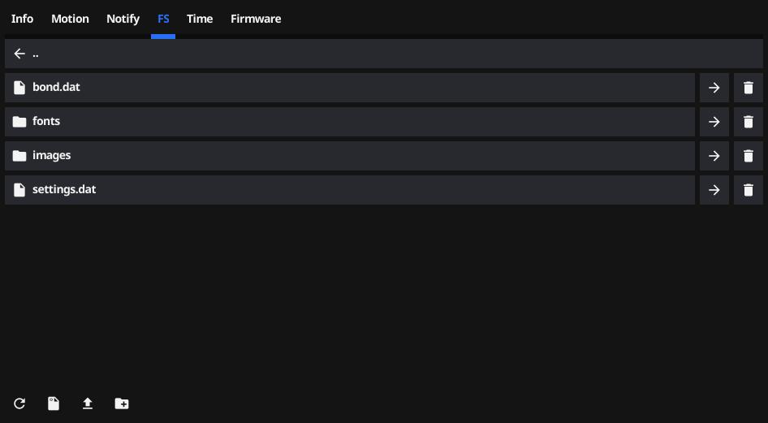
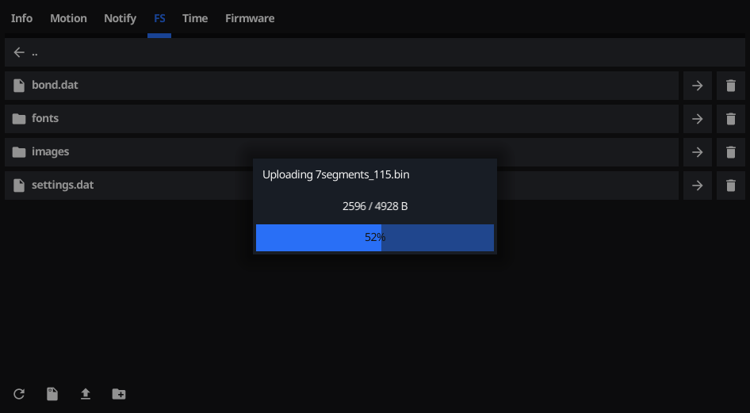
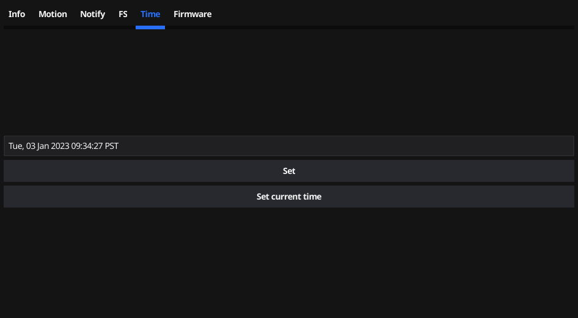

# ITD
## InfiniTime Daemon

`itd` is a daemon that uses my infinitime [library](https://go.arsenm.dev/infinitime) to interact with the [PineTime](https://www.pine64.org/pinetime/) running [InfiniTime](https://infinitime.io).

[](https://ci.arsenm.dev/Arsen6331/itd)
[](https://aur.archlinux.org/packages/itd-git/)
[](https://aur.archlinux.org/packages/itd-bin/)

---

### Features

- Notification relay
- Notification transliteration
- Call Notifications (ModemManager)
- Music control
- Get info from watch (HRM, Battery level, Firmware version, Motion)
- Set current time
- Control socket
- Firmware upgrades
- Weather
- BLE Filesystem
- Navigation (PureMaps)

---

### Installation

Since ITD 0.0.7, packages are built and uploaded whenever a new release is created.

#### Arch Linux

Use the `itd-bin` or `itd-git` AUR packages.

#### Debian/Ubuntu

- Go to the [latest release](https://gitea.arsenm.dev/Arsen6331/itd/releases/latest) and download the `.deb` package for your CPU architecture. You can find your architecture by running `uname -m` in the terminal.
- Run `sudo apt install <package>`, replacing `<package>` with the path to the downloaded file. Note: relative paths must begin with `./`.
- Example: `sudo apt install ~/Downloads/itd-0.0.7-linux-aarch64.deb`

#### Fedora

- Go to the [latest release](https://gitea.arsenm.dev/Arsen6331/itd/releases/latest) and download the `.rpm` package for your CPU architecture. You can find your architecture by running `uname -m` in the terminal.
- Run `sudo dnf install <package>`, replacing `<package>` with the path to the downloaded file.
- Example: `sudo dnf install ~/Downloads/itd-0.0.7-linux-aarch64.rpm`

#### Alpine (and postmarketOS)

- Go to the [latest release](https://gitea.arsenm.dev/Arsen6331/itd/releases/latest) and download the `.apk` package for your CPU architecture. You can find your architecture by running `uname -m` in the terminal.
- Run `sudo apk add --allow-untrusted <package>`, replacing `<package>` with the path to the downloaded file.
- Example: `sudo apk add --allow-untrusted ~/Downloads/itd-0.0.7-linux-aarch64.apk`

Note: `--allow-untrusted` is required because ITD isn't part of a repository, and therefore is not signed.

---

### `itctl`

This daemon comes with a binary called `itctl` which uses the socket to control the daemon from the command line. As such, it can be scripted using bash.

This is the `itctl` usage screen:
```
NAME:
   itctl - A new cli application

USAGE:
   itctl [global options] command [command options] [arguments...]

COMMANDS:
   help            Display help screen for a command
   resources, res  Handle InfiniTime resource loading
   filesystem, fs  Perform filesystem operations on the PineTime
   firmware, fw    Manage InfiniTime firmware
   get             Get information from InfiniTime
   notify          Send notification to InfiniTime
   set             Set information on InfiniTime
   update, upd     Update information on InfiniTime
   watch           Watch a value for changes

GLOBAL OPTIONS:
   --socket-path value, -s value  Path to itd socket (default: "/tmp/itd/socket")
```

---

### `itgui`

In `cmd/itgui`, there is a gui frontend to the socket of `itd`. It uses the [Fyne library](https://fyne.io/) for Go.

#### Easy Installation

The easiest way to install `itgui` is to use my other project, [LURE](https://gitea.arsenm.dev/Arsen6331/lure). LURE will only work if your package manager is `apt`, `dnf`, `yum`, `zypper`, `pacman`, or `apk`.

Instructions:

1. Install LURE. This can be done with the following command: `curl https://www.arsenm.dev/lure.sh | bash`.
2. Check to make sure LURE is properly installed by running `lure ref`.
3. Run `lure in itgui`. This process may take a while as it will compile `itgui` from source and package it for your distro.
4. Once the process is complete, you should be able to open and use `itgui` like any other app.

#### Compilation

Before compiling, certain prerequisites must be installed. These are listed on the following page: https://developer.fyne.io/started/#prerequisites

It can be compiled by running:

```shell
go build ./cmd/itgui
```

#### Cross-compilation

Due to the use of OpenGL, cross-compilation of `itgui` isn't as simple as that of `itd` and `itctl`. The following guide from the Fyne website should work for `itgui`: https://developer.fyne.io/started/cross-compiling.

#### Screenshots













---

### Installation

To install, install the go compiler and make. Usually, go is provided by a package either named `go` or `golang`, and make is usually provided by `make`. The go compiler must be version 1.17 or newer for various new `reflect` features.

To install, run
```shell
make && sudo make install
```

---

### Socket

This daemon creates a UNIX socket at `/tmp/itd/socket`. It allows you to directly control the daemon and, by extension, the connected watch.

The socket uses the [DRPC](https://github.com/storj/drpc) library for requests. The code generated by this framework is located in [`internal/rpc`](internal/rpc)

The API description is located in the [`internal/rpc/itd.proto`](internal/rpc/itd.proto) file.

---

### Starting

To start the daemon, run the following **without root**:

```shell
systemctl --user start itd
```

To autostart on login, run:
```shell
systemctl --user enable itd
```

---

### Cross compiling

To cross compile, simply set the go environment variables. For example, for PinePhone, use:

```shell
make GOOS=linux GOARCH=arm64
```

This will compile `itd` and `itctl` for Linux aarch64 which is what runs on the PinePhone. This daemon only runs on Linux due to the library's dependencies (`dbus`, and `bluez` specifically).

---

### Configuration

This daemon places a config file at `/etc/itd.toml`. This is the global config. `itd` will also look for a config at `~/.config/itd.toml`.

Most of the time, the daemon does not need to be restarted for config changes to take effect.

---

### Attribution

Location data from OpenStreetMap Nominatim, &copy; [OpenStreetMap](https://www.openstreetmap.org/copyright) contributors

Weather data from the [Norwegian Meteorological Institute](https://www.met.no/en)